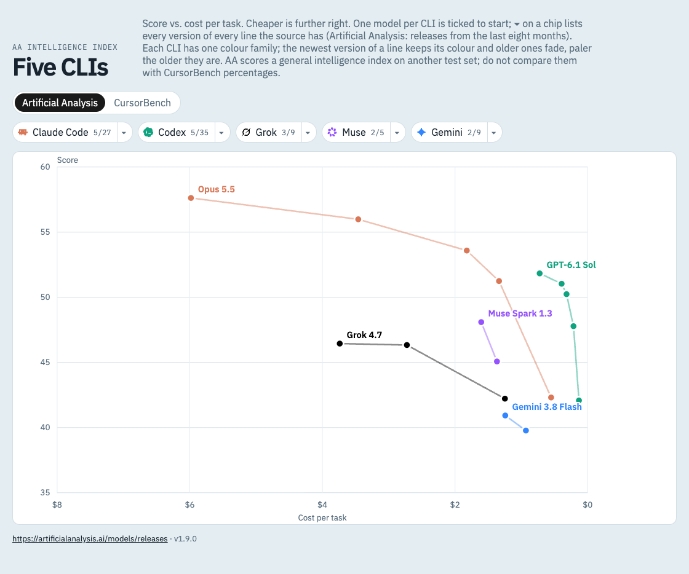
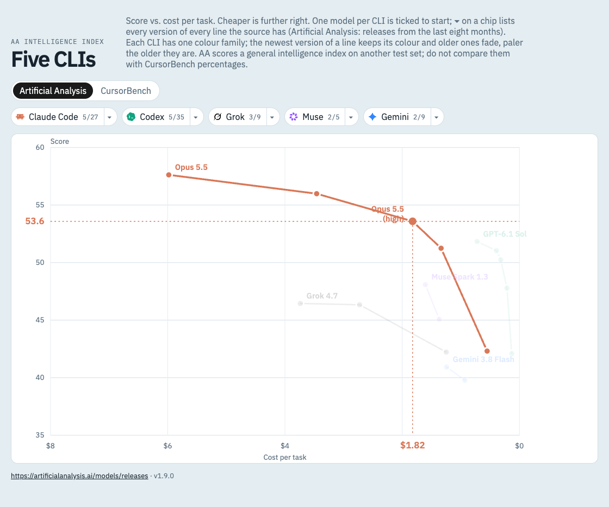
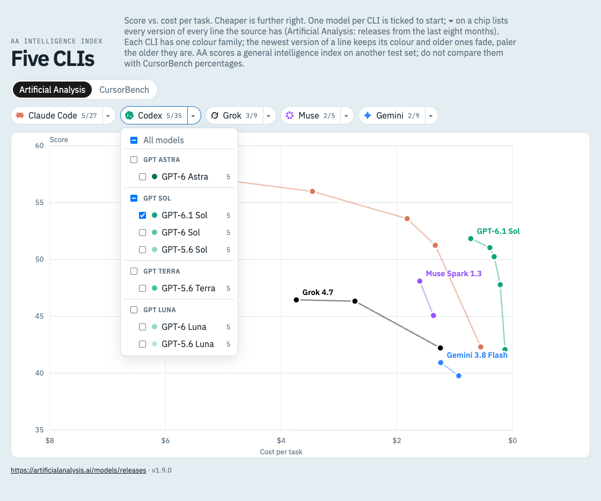
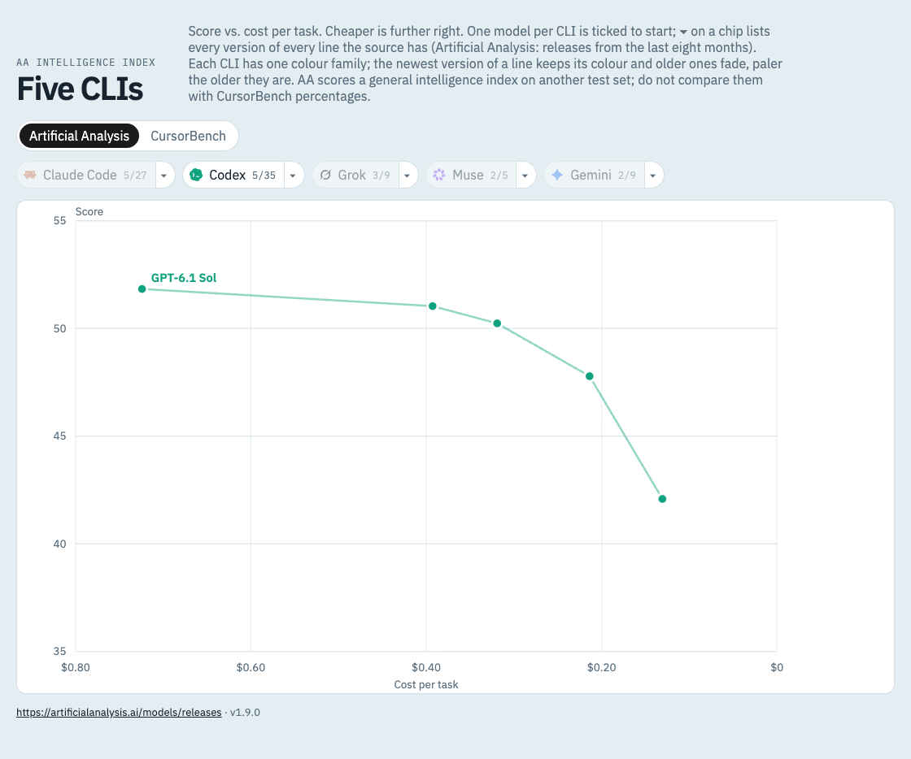
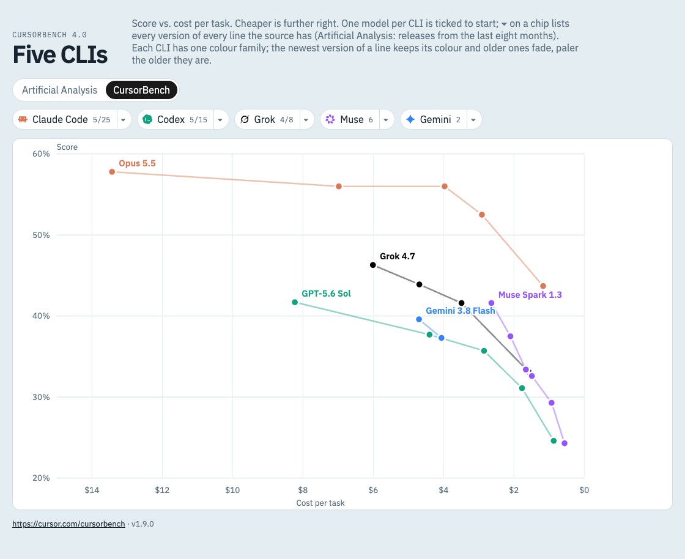

# cursorbench

A small local viewer for the [CursorBench](https://cursor.com/cursorbench) leaderboard. It plots **score vs. cost per task** for the models behind five coding CLIs, so you can see at a glance which model and effort level gives the most score per dollar.

| CLI         | Lines drawn (every listed version of each)                |
| ----------- | --------------------------------------------------------- |
| Claude Code | Fable, Opus, Sonnet                                       |
| Codex       | GPT Astra, Sol, Terra, Luna                               |
| Grok        | Grok, Grok Build                                          |
| Muse        | Muse Spark, Muse Glimmer                                  |
| Gemini      | Gemini Argon, Flash, Flash-Lite, Pro                      |

Every effort level listed on CursorBench (Minimal → Max) appears as its own point, and each model's points are connected into one line.

The page opens on Artificial Analysis, with one model ticked per CLI: Opus 5.5, GPT-6.1 Sol, Grok 4.7, Muse Spark 1.3 and Gemini 3.8 Flash. A CLI that has none of these on a source gets the first model of its menu instead (on CursorBench, Codex starts on GPT-5.6 Sol). Every other model the source lists for these five CLIs, every version of every line, is in the ▾ menu to tick. On Artificial Analysis only releases from roughly the last eight months are drawn, and a model AA scored without a cost per task (for example Opus 4.7 or Grok 4.20) cannot be placed on the cost axis and is left out.



Hovering a point spotlights that model: the other lines fade, a crosshair marks its score and cost, and a tooltip shows the details.



Each legend chip also has a ▾ menu to tick the models of that CLI one by one, grouped by line with the newest version first; a line's title ticks the whole line. Here Codex shows the default GPT-6.1 Sol, 5 of its 35 points. The screenshots on this page show the defaults.



Clicking a legend chip shows or hides that CLI. Here only Codex is visible.



**Version rule:** every version the source lists for a line is drawn, so on Artificial Analysis GPT-6.1 Sol, GPT-6 Sol and GPT-5.6 Sol all appear, as do Opus 5.5 and Opus 5. Each CLI has one colour family taken from an official colour that does not clash with the others: Claude Code terracotta `#D97757`, Codex in OpenAI green `#10A37F`, Grok in xAI black, Muse in Meta AI violet `#9553FF` and Gemini blue `#3186FF`. Within a family the flagship line is darker and the small line lighter. The newest version of a line keeps its colour; older versions fade toward white, paler the older they are, so a faded line still reads as its CLI. Versions compare as decimals, so Grok 4.20 counts as older than Grok 4.7. A new version appears as soon as the source lists it, with no code change. Untick older versions in the ▾ menu to hide them.

As of 2026-10-01 CursorBench has no GPT-6 models, so it shows only GPT-5.6. GPT-6 has no Terra line.

**Data source switch:** the toggle above the legend swaps the [Artificial Analysis](https://artificialanalysis.ai/models/releases) Intelligence Index (the default) for CursorBench, using the same lines and the same version rule. AA already lists GPT-6.1 Sol, GPT-6 Sol, GPT-6 Astra, GPT-6 Luna and Gemini 4 Argon. Its score is a general intelligence index on a different test set, so read it on its own and do not compare it with CursorBench percentages. AA scores fewer efforts for some models (Grok 4.7 and Muse Spark 1.3 have two each). CursorBench is kept in the URL as `?source=cursorbench`.



## Quick start

Requires Node.js 18 or newer.

```bash
npm install
npm run dev
```

Open the URL Vite prints (default http://localhost:5173).

## Using the chart

- **Source toggle:** Artificial Analysis (default) or CursorBench.
- **Legend chips:** each shows the CLI's product mark and is an on/off switch for the whole CLI. Turning it off and on again keeps the models you ticked in its menu. The number is how many points it has, or shown/total when some models are unticked.
- **▾ next to a chip:** tick or untick that CLI's models one by one, or all at once. Models are listed by line (Fable, Opus, Sonnet; GPT Astra, Sol, Terra, Luna; Grok, Grok Build; Muse Spark, Glimmer; Gemini Argon, Flash, Flash-Lite, Pro), newest version first within each line, under a title per line; ticking a title ticks or unticks that whole line. Esc or a click outside closes it.
- **Remembered:** chip switches and menu ticks are saved in this browser (localStorage), so a reload or the next visit keeps them. Ticks are kept per source, since the two list different models. A model a source shows for the first time starts unticked, unless it is one of the defaults above.
- **Hover** a point to highlight its label, score, and cost.
- **Click** a point to pin it. Click again to unpin.

## How the data works

CursorBench has no public API or data file, so the dev server scrapes the leaderboard page itself.

1. The browser calls `/api/bench`, served by a Vite plugin in [server/bench.mjs](server/bench.mjs).
2. The plugin fetches https://cursor.com/cursorbench (English page) and parses the leaderboard table.
3. It hashes the table text and compares it to `data/bench-cache.json`.
   - **Same hash:** the cached rows are returned as-is, with no re-parsing.
   - **Different hash:** rows are re-parsed, filtered to the models above, and the cache is rewritten.
4. If cursor.com is unreachable, the last cached rows are served instead.

The Artificial Analysis source (`/api/bench?source=aa`, in [server/aa.mjs](server/aa.mjs)) works differently:

1. It fetches the AA "All releases" page and picks every scored release of the five CLIs' providers from the last 240 days. A release is found from its release entry or from its variants, since some releases (such as GPT-5.6 Sol) only appear through their variants.
2. It fetches each picked release page (four at a time) and reads that release's own per-effort entries. An effort without an index score or a cost per task is left out; a reasoning variant with no effort level becomes one point without an effort; non-reasoning variants are left out.
3. Results are cached in `data/aa-cache.json` for 6 hours. If a release page fails, its last cached rows are kept.

`data/` is git-ignored, so the cache is created on your first run.

## Scripts

| Command           | What it does                                   |
| ----------------- | ---------------------------------------------- |
| `npm run dev`     | Start the dev server with live data            |
| `npm run build`   | Type-check and build to `dist/`                |
| `npm run preview` | Serve the build, with `/api/bench` still live  |
| `npm run lint`    | Run ESLint                                     |

`/api/bench` only exists inside the Vite dev and preview servers. Hosting `dist/` as plain static files will not load any data.

## Project layout

```
server/bench.mjs   CursorBench scraper, model filter, cache, and the /api/bench Vite plugin
server/aa.mjs      Artificial Analysis source (release pages, per-effort rows, cache)
src/App.tsx        Page layout, source toggle, data loading, visibility state
src/Legend.tsx     Legend chips and the per-CLI model menu, grouped by line
src/logos.ts       Product marks for the chips (LobeHub Icons, MIT)
src/Chart.tsx      SVG scatter/line chart (score vs. cost)
src/bench.ts       Shared types, provider colors, formatting helpers
```

## Changing which models are shown

Which providers count is `providerOf` in [server/bench.mjs](server/bench.mjs); the AA date window is `RECENT_DAYS` in [server/aa.mjs](server/aa.mjs). Edit them, then delete `data/bench-cache.json` and `data/aa-cache.json` so the next load rebuilds both caches.

## Credits

Product marks on the legend chips come from [LobeHub Icons](https://github.com/lobehub/lobe-icons) (MIT): `claudecode`, `codex`, `grok`, `metaai` (Muse has no mark of its own) and `gemini`. They are trademarks of their owners and are used only to tell the CLIs apart.

## Changelog

- **1.9.0** (2026-10-02): Opens on Artificial Analysis (CursorBench is `?source=cursorbench`) with one model ticked per CLI: Opus 5.5, GPT-6.1 Sol, Grok 4.7, Muse Spark 1.3, Gemini 3.8 Flash, or the first in the menu where a source lacks it. Ticks are kept per source, and a model that appears later starts unticked. Legend chips show each CLI's product mark. The ▾ menu is grouped by line, and a group title ticks the whole line. Colours move to official ones that do not clash: Claude `#D97757`, OpenAI green `#10A37F`, xAI black, Meta AI violet `#9553FF`, Gemini blue `#3186FF`.
- **1.8.1** (2026-10-02): The ▾ menu goes back to line first, then newest version first within a line, for every CLI. Gemini keeps Pro after Flash-Lite, so both Gemini 3.1 models stay at the bottom.
- **1.8.0** (2026-10-02): One colour family per CLI, a shade per line, and older versions fade instead of turning grey, paler the older they are. The ▾ menu lists the newest generation first, so older versions sink to the bottom (Gemini: newest number first).
- **1.7.2** (2026-10-02): In the Gemini menu, Pro comes after Flash-Lite, so both Gemini 3.1 models sit at the bottom.
- **1.7.1** (2026-10-02): Screenshots keep only the newest version of each line ticked, and the menu caption says which older versions are unticked.
- **1.7.0** (2026-10-02): Every model of the five CLIs is drawn, every version of every line (AA: releases from the last 240 days). The older-is-grey rule and the newest-first menu order now cover every line, not only GPT. Versions compare as decimals (Grok 4.20 below 4.7). Gemini 3.1 Pro Preview, a reasoning variant without an effort level, shows as one point.
- **1.6.0** (2026-10-02): Chip switches and menu ticks are remembered in the browser. A chip is now only an on/off switch: turning a CLI back on keeps the models ticked in its menu instead of ticking them all.
- **1.5.2** (2026-10-02): Menu line order is Fable, Opus, Sonnet for Claude Code and Argon, Flash for Gemini.
- **1.5.1** (2026-10-02): The ▾ menu lists models by line and newest version first, instead of by score, so the order stays put when scores change.
- **1.5.0** (2026-10-02): Dropped the newest-version-per-GPT-line rule. Every listed GPT Astra, Sol, Terra and Luna version is drawn (GPT-6 Sol and GPT-5.6 Luna now show on AA). Older versions are dark grey one step behind and light grey further back.
- **1.4.0** (2026-10-01): A ▾ menu on each legend chip ticks that CLI's models one by one. The chip count shows shown/total when some are unticked.
- **1.3.0** (2026-10-01): Fable 5.1, GPT-5.6 Sol and Gemini 4 Argon drawn on whichever source lists them. An older GPT shown beside a newer version of its line is grey. AA release discovery also reads releases that appear only through their variants.
- **1.2.0** (2026-10-01): Data source toggle between CursorBench and the Artificial Analysis Intelligence Index (`?source=aa`), so GPT-6.1 Sol, GPT-6 Astra and GPT-6 Luna can be seen before CursorBench lists them. AA rows are read per release and per effort, never borrowed from a neighbouring model.
- **1.1.0** (2026-10-01): Each GPT line shows its newest listed version (GPT-6.1 Sol replaces GPT-6 Sol, which replaces GPT-5.6 Sol). Added Sonnet 5.5 and GPT-5.6 Luna.
- **1.0.0** (2026-09-27): First release. CursorBench score vs. cost per task for five coding CLIs.
