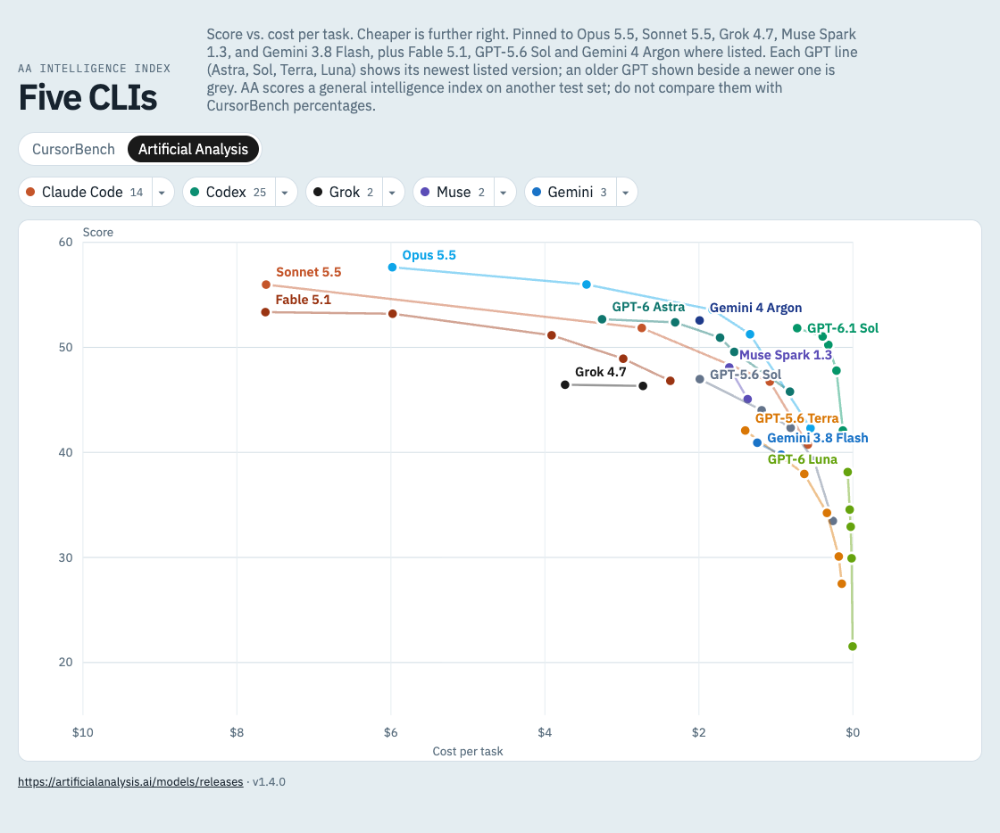

# cursorbench

A small local viewer for the [CursorBench](https://cursor.com/cursorbench) leaderboard. It plots **score vs. cost per task** for the models behind five coding CLIs, so you can see at a glance which model and effort level gives the most score per dollar.

| CLI         | Models shown                                   |
| ----------- | ---------------------------------------------- |
| Claude Code | Opus 5.5, Sonnet 5.5, Fable 5.1                |
| Codex       | GPT-5.6 Sol, Terra, Luna (see below)           |
| Grok        | Grok 4.7                                       |
| Muse        | Muse Spark 1.3                                 |
| Gemini      | Gemini 3.8 Flash, Gemini 4 Argon (AA only)     |

Every effort level listed on CursorBench (Minimal → Max) appears as its own point, and each model's points are connected into one line.

Besides the pinned models, Fable 5.1, GPT-5.6 Sol and Gemini 4 Argon are drawn on whichever source lists them. Gemini 4 Argon is on Artificial Analysis only for now.


Hovering a point spotlights that model: the other lines fade, a crosshair marks its score and cost, and a tooltip shows the details.


Each legend chip also has a ▾ menu to tick the models of that CLI one by one. Here GPT-5.6 Terra and GPT-6 Luna are unticked, so Codex shows 15 of its 25 points.


Clicking a legend chip shows or hides that CLI. Here only Codex is visible, comparing GPT-5.6 Sol, Terra and Luna across effort levels.


**GPT upgrade rule:** Codex shows one entry per GPT line: Astra, Sol, Terra and Luna. Each line uses its newest version on the leaderboard, so GPT-6.1 Sol replaces GPT-6 Sol, which replaces GPT-5.6 Sol. A line appears once the leaderboard lists it. No code change is needed. GPT-5.6 Sol is kept as an extra, so when a newer Sol is on the chart it stays as a grey comparison line.

As of 2026-10-01 the leaderboard has no GPT-6 models, so Codex still shows GPT-5.6. GPT-6 has no Terra line, so Terra stays on 5.6.

**Data source switch:** the toggle above the legend swaps CursorBench for the [Artificial Analysis](https://artificialanalysis.ai/models/releases) Intelligence Index, using the same models and the same GPT rule. AA already lists GPT-6.1 Sol, GPT-6 Astra, GPT-6 Luna and Gemini 4 Argon. Its score is a general intelligence index on a different test set, so read it on its own and do not compare it with CursorBench percentages. AA scores fewer efforts for some models (Grok 4.7 and Muse Spark 1.3 have two each). The choice is kept in the URL as `?source=aa`.



## Quick start

Requires Node.js 18 or newer.

```bash
npm install
npm run dev
```

Open the URL Vite prints (default http://localhost:5173).

## Using the chart

- **Source toggle:** switch between CursorBench and Artificial Analysis.
- **Legend chips:** click to show or hide a CLI. The number is how many points it has, or shown/total when some models are unticked.
- **▾ next to a chip:** tick or untick that CLI's models one by one, or all at once. Esc or a click outside closes it.
- **Hover** a point to highlight its label, score, and cost.
- **Click** a point to pin it. Click again to unpin.

## How the data works

CursorBench has no public API or data file, so the dev server scrapes the leaderboard page itself.

1. The browser calls `/api/bench`, served by a Vite plugin in [server/bench.mjs](server/bench.mjs).
2. The plugin fetches https://cursor.com/cursorbench (English page) and parses the leaderboard table.
3. It hashes the table text and compares it to `data/bench-cache.json`.
   - **Same hash:** the cached rows are returned as-is, with no re-parsing.
   - **Different hash:** rows are re-parsed, filtered to the models above, and the cache is rewritten.
4. If cursor.com is unreachable, the last cached rows are served instead.

The Artificial Analysis source (`/api/bench?source=aa`, in [server/aa.mjs](server/aa.mjs)) works differently:

1. It fetches the AA "All releases" page and picks the releases to show with the same model rule. A release is found from its release entry or from its variants, since some releases (such as GPT-5.6 Sol) only appear through their variants.
2. It fetches each picked release page and reads that release's own per-effort entries. An effort without an index score or a cost per task is left out.
3. Results are cached in `data/aa-cache.json` for 6 hours. If a release page fails, its last cached rows are kept.

`data/` is git-ignored, so the cache is created on your first run.

## Scripts

| Command           | What it does                                   |
| ----------------- | ---------------------------------------------- |
| `npm run dev`     | Start the dev server with live data            |
| `npm run build`   | Type-check and build to `dist/`                |
| `npm run preview` | Serve the build, with `/api/bench` still live  |
| `npm run lint`    | Run ESLint                                     |

`/api/bench` only exists inside the Vite dev and preview servers. Hosting `dist/` as plain static files will not load any data.

## Project layout

```
server/bench.mjs   CursorBench scraper, model filter, cache, and the /api/bench Vite plugin
server/aa.mjs      Artificial Analysis source (release pages, per-effort rows, cache)
src/App.tsx        Page layout, source toggle, data loading, visibility state
src/Legend.tsx     Legend chips and the per-CLI model menu
src/Chart.tsx      SVG scatter/line chart (score vs. cost)
src/bench.ts       Shared types, provider colors, formatting helpers
```

## Changing which models are shown

Edit `KEEP`, `EXTRA` and `GPT_LINES` in [server/bench.mjs](server/bench.mjs), then delete `data/bench-cache.json` and `data/aa-cache.json` so the next load rebuilds both caches.

## Changelog

- **1.4.0** (2026-10-01): A ▾ menu on each legend chip ticks that CLI's models one by one. The chip count shows shown/total when some are unticked.
- **1.3.0** (2026-10-01): Fable 5.1, GPT-5.6 Sol and Gemini 4 Argon drawn on whichever source lists them. An older GPT shown beside a newer version of its line is grey. AA release discovery also reads releases that appear only through their variants.
- **1.2.0** (2026-10-01): Data source toggle between CursorBench and the Artificial Analysis Intelligence Index (`?source=aa`), so GPT-6.1 Sol, GPT-6 Astra and GPT-6 Luna can be seen before CursorBench lists them. AA rows are read per release and per effort, never borrowed from a neighbouring model.
- **1.1.0** (2026-10-01): Each GPT line shows its newest listed version (GPT-6.1 Sol replaces GPT-6 Sol, which replaces GPT-5.6 Sol). Added Sonnet 5.5 and GPT-5.6 Luna.
- **1.0.0** (2026-09-27): First release. CursorBench score vs. cost per task for five coding CLIs.
